<!-- GitHub Profile README -->
<!-- Auto-switches between dark/light banner based on user's GitHub theme -->

<picture>
  <source media="(prefers-color-scheme: dark)" srcset="dark.svg">
  <source media="(prefers-color-scheme: light)" srcset="light.svg">
  
</picture>

---

  
  
  

<!-- 
╔══════════════════════════════════════════════════════════════════╗
║                     🎨 CUSTOMIZATION GUIDE                      ║
╠══════════════════════════════════════════════════════════════════╣
║                                                                  ║
║  To personalize this profile, edit both dark.svg and light.svg:  ║
║                                                                  ║
║  1. NAME: Search for "Geetansh" and replace with your name       ║
║  2. ASCII TERMINAL: Edit the nmap / whoami lines inside the      ║
║     left terminal panel                                          ║
║  3. ROLES: Find the 5 role texts and change them                ║
║  4. INFO: Update Location, Focus, Specialties, and GitHub link   ║
║  5. SKILLS: Modify the skill pill labels                         ║
║  6. SOCIAL: Update the social icon section                      ║
║                                                                  ║
║  Remember to make the same changes in BOTH dark.svg & light.svg ║
║                                                                  ║
╚══════════════════════════════════════════════════════════════════╝
-->
